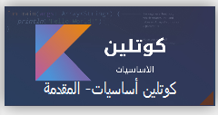
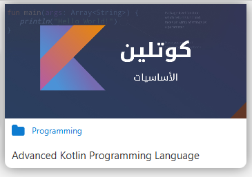
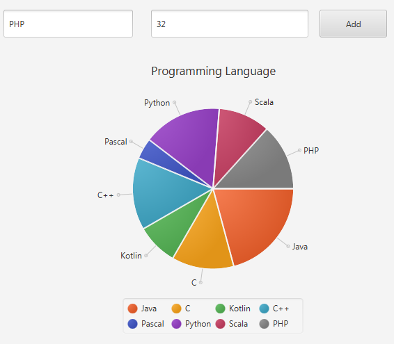
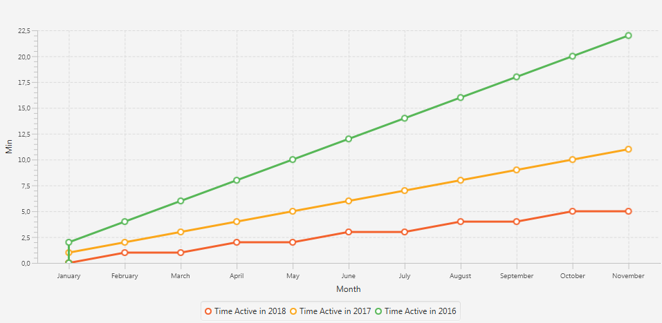
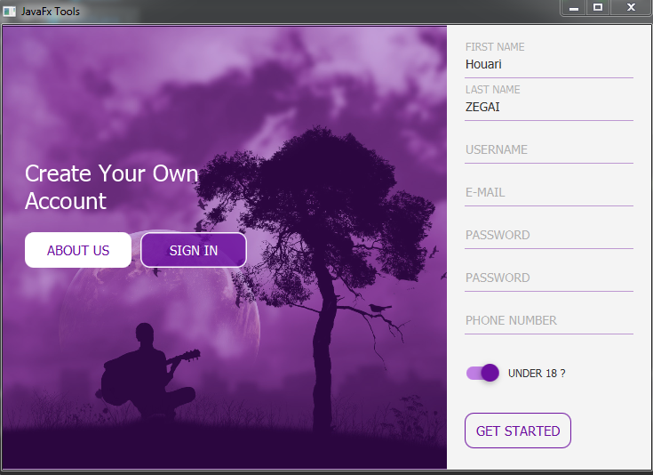

# FX Tools 🎉
My JavaFX resources, libraries &amp; ready tools (GUI) using in JavaFX projects.

## Samples

### Dashboard

|  |
|:-------:|

### CRUD

|  |
|:-------:|

### Cards

|  |  |  |
|:-------:|:----:|:----:|
|  |  |  |

### Charts

|  |  |
|:-------:|:----:|
|  | |

### Lists

|  |
|:-------:|

### Forms

|  | |
|:-------:|:----:|
|  |  |

### Slide show

|  | |
|:-------:|:----:|

## Contributing 💡
If you want to contribute to this project and make it better with new ideas, your pull request is very welcomed.
If you find any issue just put it in the repository issue section, thank you.

## Contact me
Email: houarizegai14@gmail.com  
LinkedIn: [HouariZegai](https://linkedin.com/in/houarizegai)  
Twitter: [@HouariZegai](https://twitter.com/houarizegai)
